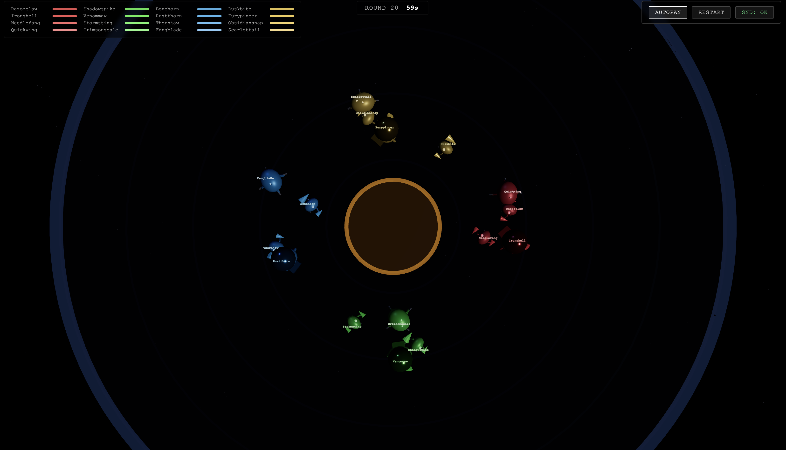

# SWARM

Browser-based multiplayer creature combat game. Players assemble multi-limbed creatures from modular parts and fight in real-time arenas. Server-authoritative via SpacetimeDB, rendered with Three.js WebGPU.

## POC 10 Demo (March 1, 2026)

<video src="pocs/poc8-arena-for-poc10/20260301-clawbattles-poc10.mp4" controls width="720">
  Video: pocs/poc8-arena-for-poc10/20260301-clawbattles-poc10.mp4
</video>

## POC Roadmap

Risk-ordered proof-of-concept sequence. Each POC isolates a single technical risk with a defined kill condition.

| # | POC | Risk Question | Status |
|---|-----|--------------|--------|
| 1 | [Rendering](#poc1--rendering) | Can WebGPU instance-render 4K+ parts at 60fps? | **PASSED** |
| 2 | [SpacetimeDB](#poc2--spacetimedb) | Do TS modules, event tables, and scheduled reducers work? | **PASSED** |
| 2.5 | [Integration](#poc25--integration) | Can Three.js render SpacetimeDB-driven positions in real time? | **PASSED** |
| 3 | [Locomotion](#poc3--locomotion) | Does procedural IK scale to 150+ multi-legged creatures? | **PASSED** |
| 3.5 | [Multiuser](#poc35--multiuser) | Does server-authoritative movement + client IK feel responsive? | **PASSED** |
| 4 | [Connections](#poc4--connections) | Do 4 joint types (magnetic/ball/hinge/spring) stay stable at 5+ parts? | Built, needs testing |
| 5 | [Editor](#poc5--editor) | Can a player build a 6-part creature in under 30 seconds? | Built, needs testing |
| 5.5 | [Editor + StDB](#poc55--editor--stdb) | Does save/load/deploy work through SpacetimeDB? | Built, needs testing |
| 6 | [Scale](#poc6--scale) | Can SpacetimeDB tick 500 creatures within 250ms? | Built, needs testing |
| 8 | [Arena](#poc8--arena) | Is combat balanced (no dominant archetype)? | **8a+8b PASSED**, 8c pending |
| 8' | [Arena for poc10](#poc8-arena-for-poc10) | StDB-backed arena + neural net agent evolution | Active / in progress |
| 9 | [Sounds](#poc9--sounds) | Does Rust/WASM FM synthesis stay under 10ms with 20+ voices? | Built, needs formal test |
| 10 | [Full Integration](#poc10--full-integration) | Do all systems compose into a playable single-page app? | Built |
| 10v | [Vocoder](#poc10-vocoder) | Can TTS be vocoded into compelling creature voices? | Built, exploratory |
| 11 | [GLB Pipeline](#poc11--glb-pipeline) | Can AI generate usable 3D part assets? | Research complete |

---

### poc1 — Rendering

`pocs/poc1-rendering/` — Single HTML file, no build step.

Three.js WebGPU instanced rendering benchmark. Sweeps 1K–1M instances with a slider to find the FPS cliff. Result: M2 Mac hits 60fps at 200K instances. Game target is ~4K parts — 90x headroom.

### poc2 — SpacetimeDB

`pocs/poc2-spacetimedb/` — SpacetimeDB module + verification script.

Proves SpacetimeDB 2.0 TypeScript modules work end-to-end: tables, reducers, event tables, scheduled reducers. Documents key 2.0 gotchas (two-file split for scheduled reducers, `event: true` syntax, `ctx.random()` instead of `Math.random()`).

### poc2.5 — Integration

`pocs/poc2.5-integration/` — Vite project, port 3001.

Connects POC 1 (WebGPU rendering) with POC 2 (SpacetimeDB). Creatures rendered in Three.js with positions driven by SpacetimeDB subscriptions. Left-click spawns, right-click moves.

### poc3 — Locomotion

`pocs/poc3-locomotion/` — Single HTML file, no build step.

Procedural FABRIK IK for 2/4/6/8-legged creatures with correct gait patterns (diagonal trot, tripod, wave gait), parabolic step arcs, body bob/tilt, wander AI. Result: 154 four-legged creatures at 1.3ms IK time. Bottleneck is rendering (individual meshes), not IK.

### poc3.5 — Multiuser

`pocs/poc3.5-multiuser/` — Vite project + SpacetimeDB module.

Server-authoritative creature movement at 10 ticks/sec with client-side IK rendering interpolated at 60fps. Multiple clients spawn and move creatures via SpacetimeDB subscriptions.

### poc4 — Connections

`pocs/poc4-connections/` — Single HTML file, no build step.

Part assembly with 4 connection types: magnetic (rigid), ball joint (constrained rotation), hinge (single-axis oscillation), spring (damped harmonic). Part detachment converts to tumbling physics objects. Creature recalculates stats/locomotion after part loss.

**Pending:** Kill condition — "Connection physics creates visible jitter or instability with 5+ connected parts."

### poc5 — Editor

`pocs/poc5-editor/` — Single HTML file, no build step.

Creature editor UX: 11 part types, 3D viewport with glowing port indicators, real-time stat readout. Click-to-attach with magnetic snap + particle burst. Bilateral symmetry toggle, undo, test walk, JSON export.

**Pending:** Kill condition — "Can a playtester build a basic 6-part creature in under 30 seconds?"

### poc5.5 — Editor + StDB

`pocs/poc5.5-editor-stdb/` — Vite project + SpacetimeDB module, port 3002.

Editor from POC 5 with SpacetimeDB persistence. Save/load/delete creature designs, community browsing, deploy button. Auto-loads deployed creature on reconnect.

**Pending:** End-to-end integration testing.

### poc6 — Scale

`pocs/poc6-scale/` — Vite client + SpacetimeDB module.

Load test dashboard. Spawns 10–500 creatures, displays rolling latency chart with a 250ms kill-condition threshold line. Tests scheduled reducer performance and chunk-based spatial subscriptions.

**Pending:** Actually running the test at 500 creatures and verifying tick budget.

### poc8 — Arena

`pocs/poc8-arena/` — Pure Node.js/bun, no browser UI.

Headless combat simulation engine + balance harness. 11 part types, 6-phase tick loop, part-based damage with detachment, sensory model (eyes + antenna + proprioception). 4 named archetypes (Berserker, Flanker, Tank, Spiker) in round-robin tournament. Result: 3,200 matches/second, all archetypes at 23–27% win rate.

**8c pending:** Three.js arena viewer for match playback + REST/WebSocket API for agent creature submission.

### poc8-arena-for-poc10

`pocs/poc8-arena-for-poc10/` — Evolved fork of poc8-arena.

Extends the simulation with neural net brains (24-16-8-4), richer part catalog (centipede body, wings, stingers, mandibles), stamina/fatigue system, team combat (4 teams of 4). Adds SpacetimeDB server module and a live evolution agent that can run against either SpacetimeDB or headless. Contains the `baseline-spec.md` living architecture document.

**This is the active development frontier.**

### poc9 — Sounds

`pocs/poc9-sounds/` — Rust/WASM crate + Vite web workbench.

Generative creature sounds via FM + glottal synthesis in AudioWorklet. 5 sound types (footstep, claw strike, part detach, idle breath, vocalize), 32-voice polyphony with LRU stealing, soft-clip limiter. SharedArrayBuffer telemetry bridge. WASM is pre-built.

**Pending:** Formal kill condition test — latency under 10ms with 20+ simultaneous voices.

### poc10 — Full Integration

`pocs/poc10/` — Vite project with pre-built dist.

Single-page app integrating all prior POCs: Menu → Teams (2x2 creature grid) → Editor → Arena. Combat runs locally (no SpacetimeDB). All 9 simulation modules, 4 screen modules, 3 rendering modules, 3 audio modules.

**Note:** Uses WebGLRenderer (deliberate deviation from WebGPU for this POC).

**Pending:** Screen transitions, persistence (team edits lost on refresh).

### poc10-vocoder

`pocs/poc10-vocoder/` — Docker (KittenTTS) + Vite web client, ports 5100/3010.

TTS-driven channel vocoder for creature voice synthesis. Three vocoder modes: FM Creature (4 carrier types), Shepard's Tone (resonant filter bank), Cylon (authentic EMS Vocoder 2000 architecture with sawtooth carrier, cascaded 24dB/oct BPFs, distortion, envelope-follower phaser). LFO modulation on all parameters. WAV export.

### poc11 — GLB Pipeline

`pocs/poc11-glb/` — Node.js tooling.

AI-generated 3D asset pipeline. Evaluated Tripo, Meshy, and Rodin for text/image-to-3D. Built processing pipeline: generate → simplify (293K→5.8K faces, 98% reduction) → resize PBR textures (8.9MB→131KB) → normalize (origin, scale, orientation). Winner: Tripo image-to-3D. Full library cost: $13–22.

**Pending:** Generate full part library (45–75 GLBs across 15 part types, 3–5 variants each). Pipeline is proven, remaining work is mechanical.

## Tech Stack

- **Renderer:** Three.js WebGPU (`WebGPURenderer` only — no WebGL)
- **Server:** SpacetimeDB 2.0 (TypeScript modules, server-authoritative)
- **Audio:** Rust/WASM FM synthesis in AudioWorklet + Web Audio API vocoder
- **3D Assets:** AI-generated GLBs via Tripo (image-to-3D) + meshoptimizer
- **Build:** Vite + bun
- **Language:** TypeScript (client + SpacetimeDB modules), Rust (audio WASM)

## License

[Apache License 2.0](LICENSE)
